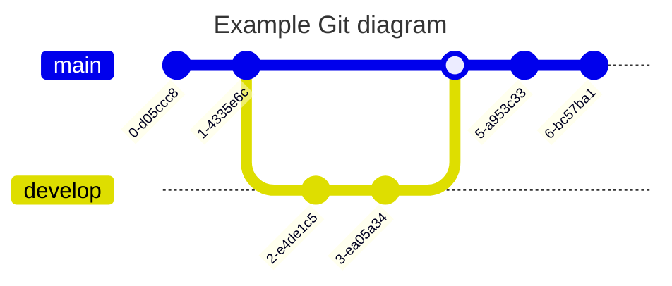

# mermaid 各种图表

[Mermaid 官网](https://mermaid.js.org/intro/)

# Flowchart

# Gantt diagram

# Class diagram

# Git graph

# Entity Relationship Diagram

# User Journey Diagram

# State Diagram

# Pie Chart Diagram

# Requirement Diagram

# Sequence diagram

# Timeline Diagram

# Mindmap

