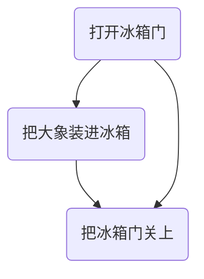
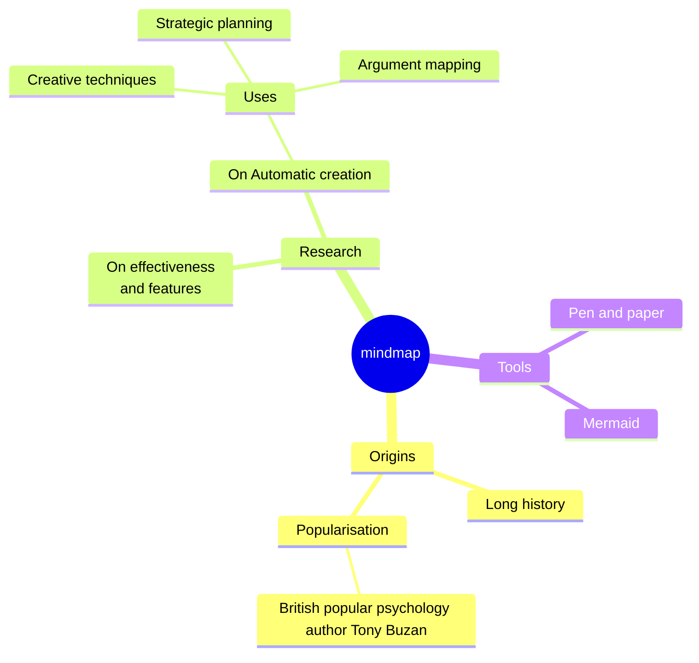

# markdown preview 效果检视

[Markdown Preview Enhanced 插件]: https://shd101wyy.github.io/markdown-preview-enhanced/
[Markdown Preview Mermaid Support 插件]: https://github.com/mjbvz/vscode-markdown-mermaid
[Markdown Preview Markmap Support 插件]: https://github.com/phoihos/vscode-markdown-markmap

# 数学公式

## KaTeX inline 模式（`$...$`）
- VSCode 内建支持

$E = mc^2$

## KaTeX block 模式（`$$...$$`）
- VSCode 内建支持

$$E = mc^2$$

## fenced code block 模式
- [Markdown Preview Enhanced 插件] 独立支持

```math
E = mc^2
```

# mermaid 流程图
- [Markdown Preview Enhanced 插件] 独立支持
- [Markdown Preview Mermaid Support 插件] 扩展支持



# mermaid 思维导图
- [Markdown Preview Mermaid Support 插件] 扩展支持



# sequence 时序图
- [Markdown Preview Enhanced 插件] 独立支持

```sequence
Andrew->China: Says Hello
Note right of China: China thinks\nabout it
China-->Andrew: How are you?
Andrew->>China: I am good thanks!
```

# markmap 思维导图
- [Markdown Preview Markmap Support 插件] 扩展支持
- **本项目插件扩展支持**

```markmap
# Mindmap

## Extension

- [markdown-markmap](https://github.com/phoihos/vscode-markdown-markmap)

## Powered by

- <https://markmap.js.org/>
- [markmap-lib](https://github.com/gera2ld/markmap-lib)

## Highlighting

- links
- **inline** ~~text~~ *styles*
- multiline
  text
- `inline code`
-   ```js
    console.log('code block');
    ```
- Katex
  - $\pm\sqrt{a^2 + b^2}$
  - $x = {-b \pm \sqrt{b^2-4ac} \over 2a}$
  - $$\int_{0}^{\infty} f(x) dx$$
```
